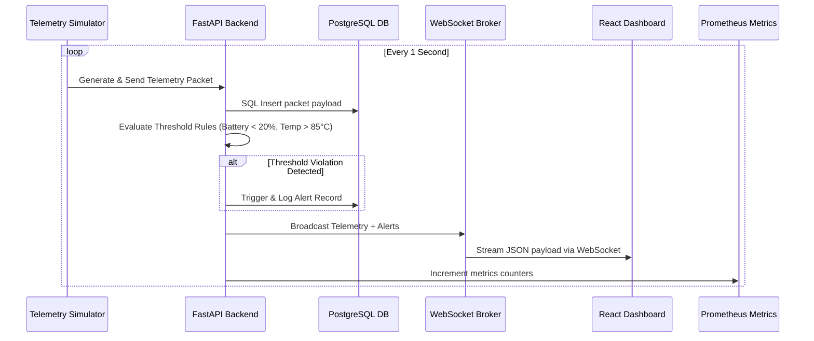

# Ground Station Telemetry Architecture Specifications

This document details the architectural layout, microservices relationships, and data flow pipelines of the **Satellite Telemetry Monitoring and Alert System (STMAS)**.

---

## 🏗️ System Architecture Topology

The ground station gateway is composed of five decoupled layers:

1. **Space segment Simulation**: Background thread generating coordinate trajectories (latitudes/longitudes based on sinusoidal ground track mapping) and orbital metrics (altitudes, battery decays, voltages) for three satellites.
2. **Ground Station Gateway (FastAPI)**: Asynchronous REST endpoint gateway that routes telemetry logs into PostgreSQL, evaluates rule-based alarm conditions, and broadcasts state packets via WebSockets.
3. **Observability Stack (Prometheus + Grafana)**: Scraping `/metrics` endpoints to track API latency, host memory load, and database connection pools.
4. **Log Forwarding (ELK Stack)**: Shipping container/system stdout streams to Logstash using json-formatted log shippers, storing them in Elasticsearch, and visualizing them in Kibana.
5. **Infrastructure provisioning (Terraform + Kubernetes)**: Declaratively configuring AWS VPC subnets, AWS EKS Kubernetes clusters, and RDS Postgres databases via modular Terraform code, then running deployments with HPAs, RBAC, and services.

---

## 🔄 Telemetry Data Flow

---

## 🔒 Security Architectures

- **Network Isolation**: All Kubernetes pods (Postgres, Backend) run inside private subnets. External traffic is only allowed through the Nginx Ingress Controller routing.
- **RBAC**: Kubernetes resources are restricted via local namespace Roles. Backend APIs enforce roles (`Administrator`, `Operator`, `Viewer`) in JWT payload keys.
- **Least Privilege**: Docker containers run as non-root users inside minimal Alpine-based base images.
